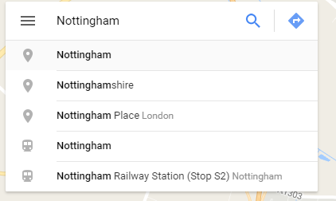
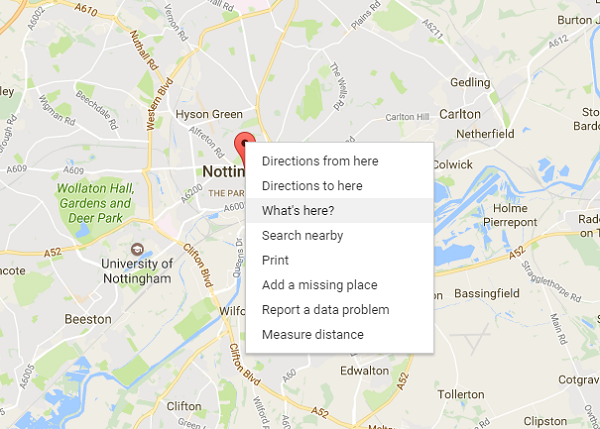
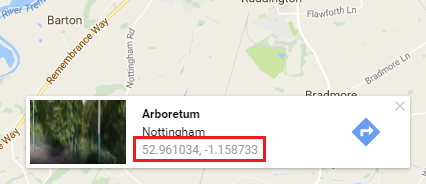

# Poo near you

In this resource you will use the Google maps API to map open data onto a map using JavaScript.

## Using open data

Open data is data that is made available for public use, for free and without restrictions. All sorts of organisations publish open data, including governments, charities and companies. You can find open data on a wide variety of topics using a search engine.

Lots of cities publish their own open data. For this resource we are going to use some open data published by the city of Nottingham, UK. It is important to respect the license specified by the publisher of the data, and only to use the data for things allowed by the license. For us to be allowed to use this data, Nottingham City Council asks us to provide an acknowledgement to let people know where the data originally came from, and a link to the license, like this:

[Fixed Penalty Notices](http://www.opendatanottingham.org.uk/dataset.aspx?id=124), Nottingham City Council, 4th July 2016, licensed under the [Open Government Licence](http://www.nationalarchives.gov.uk/doc/open-government-licence/version/3/)

## Create a web page

1. Open up a blank file in your chosen text editor and save the file as follows:

 -  If you're using **Notepad** on Windows, type the filename in as `index.html` and change the drop-down for the "Save as" type to **All files**.

  

 - If you're using **TextEdit** on Mac OS, open a new file, then select `Format` > `Make Plain Text`.

  

  Make sure you save the file as `index.html`.

  

 - If you're using **Nano** on a Raspberry Pi, open a terminal window, move to the directory in which you wish to create your web page, and type `nano index.html`.

  

2. This HTML code gives you the basic structure of a page. Copy and paste the code into the file you created, then save the file.

  ```html
  <html>
  <head>
    <title>My map</title>
  </head>
  <body>
    My map will go here
  </body>
  </html>
  ```

3. Go to the folder where you saved your web page. Open the file with your internet browser, so now you'll have the same file open in both your text editor and your browser at the same time.

  On Windows, you may need to right-click the file, choose `Open with`, and then select your internet browser.

  

  Whenever you change the code in your text editor, save it and then press the refresh button on your browser to see the page update.


## Get a Google maps API key

Next, you'll need to create a Google Maps API key. An API (or Application Programming Interface) is a set of functions provided so that you can interact with another computer which does useful things for you - in this case the Google Maps server. You need to have an **API key** to access it so that Google knows who it has allowed to use its services.

1. Follow steps 1-4 on [this page](https://developers.google.com/maps/documentation/javascript/adding-a-google-map#step_3_get_an_api_key) to obtain a Google Maps API key.

1. Go back to your `index.html` file and position your cursor just before the `</body>` tag. Paste in the code below:

    ```html
    <script async defer
      src="https://maps.googleapis.com/maps/api/js?key=YOUR_API_KEY&callback=initMap">
    </script>
    ```

1. Locate the part in the code you just pasted which says `YOUR_API_KEY` and replace it with the API key you just generated, making sure there are no spaces between the key you paste in and the `=` and `&` characters either side of it.

## Finding a latitude and longitude

We need to be able to tell Google Maps which area we would like to see a map of.

1. Open [Google Maps](http://maps.google.com) in a web browser.

1. In the search box on the top left, type in the place you are searching for. Since the data we are using is from Nottingham in the UK, this is where we will type in. Press enter.

    

1. A map should appear with a red marker pinpointing the place you searched for. Right click on the red marker and select "What's here?".

    

1. At the bottom, a small box should pop up, and it might have the name of a local place in it. The name doesn't matter, what we are looking for are the **latitude** and **longitude** values of our place, shown here in the red box. Keep these values handy as we will need them in a minute.

    


## Add the map to your web page

1. Go back to your `index.html` file and locate the sentence in your code which says `My map will go here`. Delete this sentence - we're going to add the map in its place!

1. Add the following code to create a `<div>` (an invisible box) where your map will eventually appear:

    ```html
    <div id="map"></div>
    ```
1. Now find the `<head>` tag in your code. Position your cursor on the line after this tag and add the following code:

    ```html
    <style>
    #map {
        width: 100%;
        height: 400px;
        background-color: grey;
    }
    </style>
    ```

    This is some CSS code which will tell the map to take up the whole width of your screen, and be 400px high. You can change these values to make the map larger or smaller if you like.

1. Underneath this `<div>` code, add the following code:

    ```html
    <script>

        function initMap() {

            var Nottingham = {lat: #, lng: #};

            var map = new google.maps.Map(document.getElementById('map'), {
                zoom: 10,
                center: Nottingham
            });
        }
    </script>
    ```

1. Look at the line of code which begins `var Nottingham`. Replace the `#` symbols with the latitude and longitude values for Nottingham which you looked up on the Google Map. The first one is the latitude or `lat` and the second one is the longitude or `lng`.

    ```html
    var Nottingham = {lat: 52.961447, lng: -1.158390};
    ```
    (Your exact values might be slightly different, depending on which attraction was found when you clicked "What's here?" - this is fine!)

1. Save your code. Now go back to your `index.html` file in your web browser. Refresh the page and you should see a Google map displayed, with Nottingham at the centre of the map.


## Centre the map on Nottingham and zoom

## Geocode an address

## Set a marker on a point and mess with it (icon, drop, title)

## Using the data just typed in

## Read from a json file and map the data
