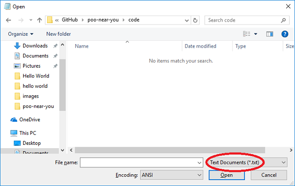
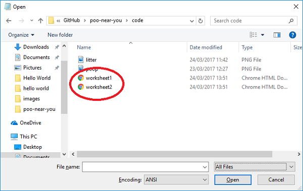
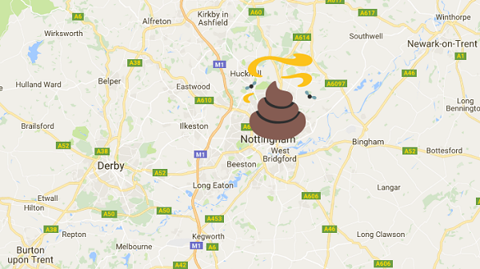

# Poo near you

In this resource you will use the Google maps API to put open data onto a map using JavaScript.

## Using open data

Open data is data that is made available for public use, for free and without restrictions. All sorts of organisations publish open data, including governments, charities and companies. You can find open data on a wide variety of topics using a search engine.

Lots of cities publish their own open data. For this resource we are going to use some open data published by the city of Nottingham, UK, which helpfully tells us all of the places where people got a fine for leaving dog poo!

It is important to respect the license specified by the publisher of the data, and to use the data only for things allowed by the license. For us to be allowed to use this data, Nottingham City Council asks us to provide an acknowledgement to let people know where the data originally came from, and a link to the license, like this:

[Fixed Penalty Notices](http://www.opendatanottingham.org.uk/dataset.aspx?id=124), Nottingham City Council, 4th July 2016, licensed under the [Open Government Licence](http://www.nationalarchives.gov.uk/doc/open-government-licence/version/3/)

## Create a web page

1. Open up a blank file in your chosen text editor and save the file as follows:

 -  If you're using **Notepad** on Windows, type the filename in as `index.html` and change the drop-down for the **Save as** type to **All files**.

  

 - If you're using **TextEdit** on Mac OS, open a new file, then select **Format** > **Make Plain Text**.

  

  Make sure you save the file as `index.html`.

  

 - If you're using **Nano** on a Raspberry Pi, open a terminal window, move to the directory in which you wish to create your web page, and type `nano index.html`.

  

2. This HTML code gives you the basic structure of a page. Copy and paste the code into the file you created, then save the file.

  ```html
  <html>
  <head>
    <title>My map</title>
  </head>
  <body>
    My map will go here
  </body>
  </html>
  ```

3. Go to the folder where you saved your HTML file. Open the file with your internet browser as well. Now you'll have the same file open in your text editor and in your browser at the same time.

  On Windows, you may need to right-click the file, choose **Open with**, and then select your internet browser.

  

  Whenever you change the code in your text editor, save it and then press the refresh button on your browser to see the page update.


## Get a Google maps API key

Next, you'll need to create a Google Maps API key. An API (or Application Programming Interface) is a set of functions provided so that you can interact with another computer - in this case the Google Maps server. You need to have an **API key** to access it, so that Google knows who it has allowed to use its services.

1. Open [this page](https://developers.google.com/maps/documentation/javascript/adding-a-google-map#step_3_get_an_api_key) and under the heading "Step 3: Get an API key", follow steps 1-4 to obtain a Google Maps API key.

1. Go back to your `index.html` file and position your cursor just before the `</body>` tag. Paste in the code below:

    ```html
    <script async defer
      src="https://maps.googleapis.com/maps/api/js?key=YOUR_API_KEY&callback=initMap">
    </script>
    ```

1. Locate the part in the code you just pasted which says `YOUR_API_KEY` and replace it with the API key you just generated, making sure there are no spaces between the key you paste in and the `=` and `&` characters on each side of it.

## Finding a latitude and longitude

We need to be able to tell Google Maps which area to show on our map.

1. Open [Google Maps](http://maps.google.com) in a web browser.

1. In the search box on the top left, type in the place you are searching for. Since the data we are using is from Nottingham in the UK, this is what we will type in. Press enter.

    

1. A map should appear with a red marker pinpointing the place you searched for. Right click on the red marker and select **What's here?**.

    

1. At the bottom, a small box should pop up, and it might have the name of a local place in it. The name doesn't matter, what we are looking for are the **latitude** and **longitude** values of our place, shown here in the red box. Keep these values handy as we will need them in a minute.

    


## Add the map to your web page

1. If you have closed the code for your webpage, open up your text editor (e.g. Notepad) and from inside the text editor reopen the `index.html` file. If you are using Notepad, you will need to change the drop down from "Text files" to "All files" (circled below) otherwise you will not be able to see the HTML files.

    

    

1. Go back to your `index.html` file and find the `<head>` tag in your code. Position your cursor on the line after this tag and add the following code:

    ```html
    <style>
    #map {
        width: 100%;
        height: 400px;
        background-color: grey;
    }
    </style>
    ```

    This is some CSS code which will tell the map to take up the whole width of your screen, and be 400px high. You can change these values to make the map larger or smaller if you like.

1. Now locate the sentence in your code that says `My map will go here`. Delete this sentence - we're going to add the map in its place!

1. Add the following code to create a `<div>` (an invisible box) where your map will eventually appear:

    ```html
    My Google map
    <div id="map"></div>
    ```

1. Immediately underneath the `<div>` code you just added, add the following code to create the map:

    ```html
    <script>

        function initMap() {

            var Nottingham = {lat: #, lng: #};

            var map = new google.maps.Map(document.getElementById('map'), {
                zoom: 10,
                center: Nottingham
            });
        }
    </script>
    ```

1. Look at the line of code which begins `var Nottingham`. Replace the `#` symbols with the latitude and longitude values for Nottingham which you looked up on the Google Map. The first one is the latitude or `lat` and the second one is the longitude or `lng`.

    ```html
    var Nottingham = {lat: 52.961034, lng: -1.158733};
    ```
    (Your exact values might be slightly different, depending on which attraction was found when you clicked "What's here?" - this is fine!)

1. Save your code. Now go back to your `index.html` file in your web browser. Refresh the page and you should see a Google map displayed, with Nottingham at the centre of the map.

## Set a marker

Let's add a marker onto our map.

1. Open up the [Nottingham Open Data page](http://www.opendatanottingham.org.uk/dataset.aspx?id=124) and click on **JSON Fixed Penalty Notices 2016**

    

1. You should now see a very long file with lots of text, telling us about fixed penalty notices people were given in Nottingham in 2016. Let's have a look at one of these as an example:

    ```JavaScript
    {
    "json_featuretype":"ncc_Fixed_Penalty_Charge_Notice_2016"
    ,"Issue_Date":"2016-01-04"
    ,"Issue_Day_Of_Week":"Monday"
    ,"Street":"Sneinton Road"
    ,"Contravention_Description":"Failing to remove dog faeces forthwith"
    ,"Amount_Paid(£)":"0"
    ,"Status":"Outstanding"
    ,"BODY":"http://data.ordnancesurvey.co.uk/id/7000000000038857\n"
    ,"BODY_NAME":"Nottingham City Council\n"
    ,"CREATE_DAT":"20160704"
    }
    ```

    We can see from the `Contravention_Description` that this person was naughty and didn't clean up some dog poo! The part we are interested in at the moment is the `Street` which is "Sneinton Road".

1. To be able to place a marker on the map, we need to know the **latitude** and **longitude** where the marker should be placed. It would be a bit annoying having to look up the latitude and longitude ourselves on Google Maps for every single marker, so let's get the computer to find it out for us! Locate the `}` just before the `</script>` tag. Add this code **before** the `}` symbol:

    ```JavaScript
    var geocoder = new google.maps.Geocoder();
    var incident_location = "Sneinton Road, Nottingham, UK";

    geocoder.geocode( { 'address': incident_location }, function(results) {

        var marker = new google.maps.Marker({
            map: map,
            position: results[0].geometry.location,
        });

    });
    ```

    Here's what this code does as pseudo code:

    ```html
    SET UP a geocoder (finds lat/lng from addresses)
    VAR incident_location EQUALS "Sneinton Road, Nottingham, UK"

    USING geocoder FIND lat/lng OF incident_location
        CREATE marker
            ADD TO map
            POSITION at the lat/lng found
        END marker
    END geocoding

    ```
1. Save your code and refresh your web page in the browser. Check that a marker was placed on Sneinton Road in Nottingham - you may need to zoom in to see!

    

1. We can make our markers a bit more interesting by animating them and changing the image. Position your cursor on a blank line immediately after the line of code where you set the position of the marker, and add the following line of code:

    ```html
    animation: google.maps.Animation.DROP,
    ```

1. Go back to your map in the web browser and refresh the page. You should now see the pin drop from the sky when the map loads!

1. Since we are mapping places where people got fined for leaving dog poo, why don't we change the marker to be a poo emoji instead! You can find lots of emojis at [Wikimedia commons](https://commons.wikimedia.org/wiki/Emoji).

1. Save a poo emoji into the same folder as your web page, and call it `poop.png`. You can use [this one](code/poop.png) if you like.

1. Add a line of code immediately before the line that begins `var marker` to create a variable containing the filename of our poo emoji:

    ```JavaScript
    var emoji = 'poop.png';
    ```

1. Now add the following code on the line after your `animation:`, inside the section where you create the marker. This will set the icon of the marker to be the poo emoji picture:

    ```JavaScript
    icon: emoji
    ```

1. The full code should now look like this:

    ```JavaScript
    var geocoder = new google.maps.Geocoder();
    var incident_location = "Sneinton Road, Nottingham, UK";

    geocoder.geocode( { 'address': incident_location }, function(results) {
        var emoji = 'poop.png';
        var marker = new google.maps.Marker({
            map: map,
            position: results[0].geometry.location,
            animation: google.maps.Animation.DROP,
            icon: emoji
        });

    });
    ```

1. Save your code, go back to your browser and refresh the page. You should see a poop emoji appear instead of a marker!

    

    When I did this, the emoji I saved was quite big so it covered the whole of Nottingham with poo (and made me laugh a lot!) If your emoji is too big, you can resize it using an image editing program, or you could download and use [this small one](code/poop.png) instead.

    

    Phew, that's better!

The full code from this section can be seen [here](https://raw.githubusercontent.com/raspberrypilearning/poo-near-you/master/code/worksheet1.html)

## What next?

- Mark more than one piece of data on the map
- Create a map of a different place and add your own markers

Or, head over to [worksheet 2](worksheet2.md) to find out how to use some more complicated code to automatically add lots of data to your map!
