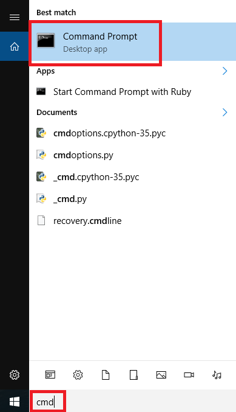
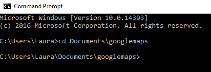
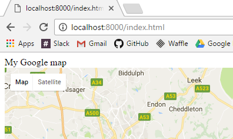
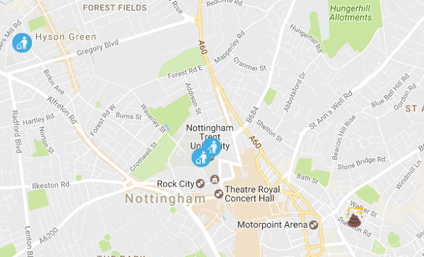

# Poo near you (part 2)

So far, you have learnt how to mark a location on a map by finding its latitude and longitude, and you know how to customise the marker as an emoji. The data file we looked at contains a lot of data though, and typing lots of things in would take a long time. Let's get the computer to automatically retrieve the data and plot it on the map for us!

## Run a local web server

The open data we found was in a format called JSON (JavaScript Object Notation) which is easy to read and work with using JavaScript. You may find many other open data sources as JSON, and you can access these using the methods we will show you. To be able to read the data automatically, you will need to run a web server on your computer. Fortunately, as long as you have Python 3 installed, you already have the capability to run a very basic web server!

**On some networks (for example in schools) the use of the command prompt and certain ports will be restricted, so you may need to ask for support from your network manager to complete this part of the resource.**

### Running a web server

1. Open a terminal (Raspberry Pi, Mac) or Command Prompt (Windows):

    **Windows**

    

    **Raspberry Pi**

    

    **Mac**

    


1. Change to the directory your web page is saved in by typing `cd` followed by a space, then the path to the directory. An example directory is shown, but you may have saved your web page in a different location, so make sure you use the path to the directory you used. Be careful - Windows uses `\` between directories, but Mac and Raspberry Pi both use `/`.

    **Windows**

    

    **Raspberry Pi**

    ```bash
    cd /home/pi/googlemaps
    ```

    **Mac**

    ```bash
    cd Documents/googlemaps
    ```

1. Type the following command to start the web server, which will serve files from the directory you were in when you started it.

    **Windows**

    ```bash
    python -m http.server
    ```

    **Raspberry Pi and Mac**

    ```bash
    python3 -m http.server
    ```

1. You should see a message that will be similar to this - `Serving HTTP on 0.0.0.0 port 8000 ...`

1. Open up a web browser. In the address bar, type in `http://localhost:8000/index.html` and press enter. You should see your map webpage appear, but this time it is being __served__ to you by the Python web server!

    

You may be curious as to why it is necessary to run a web server - why can't we just carry on looking at the web page as we did in worksheet 1? The explanation for why this is necessary is at the end of this worksheet.

## Read the JSON data and plot it on the map

1. Load up the [Open Data Nottingham](http://www.opendatanottingham.org.uk/dataset.aspx?id=124) page in your web browser.

1. Right click on **JSON Fixed Penalty Notices 2016** and choose to save the file. Name it `penalties.json` and make sure you save it into the same folder as your webpage.

1. Now go back to your text editor and look at the code for your web page. Locate the `</head>` tag, and paste in this line of code on the line immediately before it:

    ```html
    <script src="http://code.jquery.com/jquery-latest.js"></script>
    ```

    This line of code lets us use jQuery, which is a useful JavaScript library that we will use to process the JSON data.

1. Now locate the line of code beginning `var incident_location`. Delete this line and replace it with a variable telling us where the JSON file is:

    ```JavaScript
    var data_file = "http://localhost:8000/penalties.json";
    ```

    You will notice that we have specified the path to this file as being on `localhost` - this means the file will be __served__ through the web server, rather than accessed as a file on your computer. This is very important - without this, JavaScript will not allow us to use the JSON file.

1. Immediately after the line you just added, add in the following code which reads data from the JSON file:

    ```JavaScript
    $.getJSON(data_file, function(data){

    });
    ```

1. The JSON file has lots of data in it, so instead of only processing one piece of data, we need to process a lot of them - we are going to need a loop. Between the opening and closing curly brackets, add some code to loop through __each__ of the objects returned by the JSON file. Your code should now look like this:

    ```JavaScript
    $.getJSON(data_file, function(data){
        $.each(data, function(i){

        });
    });
    ```

1. Inside the curly brackets belonging to the `$.each` loop, create a variable containing the location.

    ```JavaScript
    var incident_location =  data[i]["Street"] + ", Nottingham, UK";
    ```

    Here's what this code does:
    - `var incident_location =` - Create a variable called `incident_location` (this is deliberately the same name as the variable we deleted earlier)
    - `data[i]["Street"]` - The `$getJSON` function gives us the `data` from the JSON file. Each time the `$.each` loop runs, it looks at a new item of data. The item it is currently looking at is item `[i]`. From the current data, we want to look specifically at the `["Street"]`
    - `+ ", Nottingham UK"` - We are adding on "Nottingham, UK" to the street name. This is so the Geocoder has a bit more information about the location when it looks it up - for example there may be lots of streets in the UK with the same name, so we need to be specific that we want the one in Nottingham.

1. We will only plot the first ten items from the data. This is because using the geocoder is "expensive" in computational terms, so Google Maps has a quota on how many geocodes you can do per day, and how quickly you can do them. If you attempt to geocode all of the data at once, your code will fail after the first ten. You will be making requests too quickly for the geocoder API, and Google will stop letting you use the geocoder! Add in this block of code immediately after `var incident_location` to tell the loop to stop after the first ten results:

    ```JavaScript
    if( i == 10 ){ return false; }
    ```

1. Now highlight all of your existing `geocoder` code. Move this code so that it is also inside the curly brackets, immediately after the `if` statement you added in the previous step. Your final code should look like this:

    ```JavaScript
    $.getJSON(data_file, function(data){
        $.each(data, function(i){
            var incident_location =  data[i]["Street"] + ", Nottingham, UK";

            if( i == 10 ){ return false; }

            geocoder.geocode( { 'address': incident_location }, function(results) {
                var emoji = 'poop.png';
                var marker = new google.maps.Marker({
                    map: map,
                    position: results[0].geometry.location,
                    animation: google.maps.Animation.DROP,
                    icon: emoji
                });

            });
        });
    });
    ```

1. Save your file and then refresh the page being served from `http://localhost:8000/index.html`. You should see ten locations marked on your map!

    

## Adding more data

1. Now that we have access to all the JSON data, we can also plot some of the other data at each data point. Locate the line `icon: emoji`. Add a comma at the end of the line so that we can add another parameter on the line below.

1. Add a line below to plot the description of the penalty on the data marker:

    ```JavaScript
    icon: emoji,
    title: data[i]["Contravention_Description"]
    ```

1. Refresh your map. When you hover your mouse over one of the icons, you will see the type of penalty appear in a tooltip.

    


## Using different emojis

You will see that lots of the incidents are not to do with dog poo - they are actually to do with dropping litter. Let's add a different emoji depending on the type of incident.

1. Save a suitable emoji image to mark litter being dropped. The emoji should be saved as `litter.png` and it should be saved into the same folder as your webpage. If you want to, you can use [this one](code/litter.png) from [Wikimedia Commons](https://commons.wikimedia.org/wiki/Emoji).

1. Add an 'if' statement to check the type of incident. If it is litter, change the variable to use the litter emoji. Otherwise, we will stick with the default poop emoji.

    ```javascript
    if(data[i]["Contravention_Description"].toLowerCase() == "leaving litter"){
        emoji = 'litter.png';
    }
    ```

    We have converted the `Contravention_Description` to lowercase because some of the descriptions in the data say "Leaving litter" and some say "Leaving Litter". Although a human can understand that these both mean the same thing, the computer thinks they are different. We convert the description to all lowercase and then compare it to the phrase "leaving litter" in all lowercase, so that capitalisation doesn't matter.

1. Save your code, then go back to the web browser and refresh the page. You should see two different types of emoji to show different types of incident.

    

1. The finished code is [here](code/worksheet2.html) for you to have a look at.

## Why did we need to run a web server?

We need to __serve__ our webpage via a web server so that we can process the JSON data.

When data is hosted on the web, web servers have to be careful that they do not open themselves up to attacks from hackers. You may have seen warnings before about cross-site scripting attacks (or XSS for short), which can allow hijackers to put their own malicious code on normal, legitimate websites. To stop this from happening, web browsers operate a **same origin policy**, which means that code on webpage 1 can only access data from webpage 2 if both pages are of the same origin (which very roughly means "are hosted on the same server").

So now we have a problem. We want our web page to access the JSON data, but our script will not be running on the same server as the data.

**Why can't I just download the JSON file from the data source and access it as a file on my computer?**

When you look at your webpage by just opening it up in the web browser, the address will start with `file://`, as will the JSON file if it is saved on your computer.

  

For security reasons, JavaScript doesn't allow you to access local files (files on the same computer) so this approach won't work.

**The fix - download the JSON file and serve it up via a local web server**

This is the method we used, and here's why it works. By running the simple Python web server, you are making your computer "serve" up the pages to your web browser. When you visit `http://localhost:8000` it is similar to when you visit a real website - you are making a request to a server which then sends you back the page you asked for.

If you put your `index.html` file on your web server, and then access it as `http://localhost:8000/index.html`, its **origin** is `http://localhost:8000`. If you also send your JSON file via the web server, it can be accessed at `http://localhost:8000/penalties.json` and so its **origin** is __also__ `http://localhost:8000`. This satisfies the same origin rule, and so we are able to access the JSON data in our JavaScript!

Incidentally, some web servers offering JSON data are set up to send a special header allowing access from different origins. The server with the data used in this resource does not have this set up, so we downloaded the file and served it locally.


## What next?
- Find some different open data and plot it onto a map
- Can you customise your map any further? Have a look at the [Google maps API documentation](https://developers.google.com/maps/documentation/javascript/tutorial) and see what else you can add
